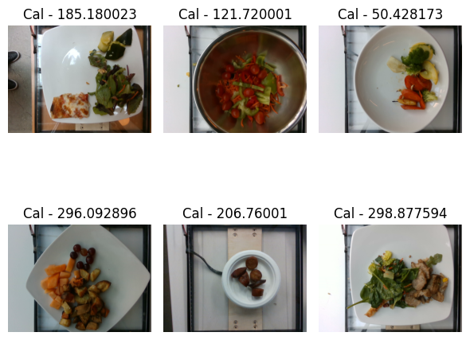

# Оценка калорийности блюд (Мультимодальная модель)

Данный проект реализует **мультимодальную нейронную сеть** для предсказания **общей калорийности блюд** на основе двух типов данных: **фотографий** и **списков ингредиентов**.

Модель объединяет в себе:

* **DistilBERT** в качестве текстового энкодера для обработки описаний ингредиентов.
* **ConvNeXt-Tiny** как визуальный энкодер (предобученный на ImageNet) для извлечения признаков из изображений.
* **Механизмы слияния (Fusion):** использование **Cross-Attention** и **FiLM-адаптации** для глубокого взаимодействия текстовых и визуальных признаков.
* **MLP-регрессор**, который объединяет полученные признаки и массу блюда для финального прогноза.

---

## Датасет

Набор данных включает в себя:

* `ingredients.csv`: соответствие ID ингредиентов и их названий.
* `dish.csv`: данные о блюдах (ID, список ингредиентов, общая масса, целевая калорийность и метки разделения на выборки).
* `images/`: фотографии каждого блюда в формате `dish_id/rgb.png`.

Целевая переменная — **общая калорийность блюда (total_calories)**.



---

## Структура проекта

```
data/                # данные: test, train, val, dish, ingredients
model/               # сохраненные веса лучшей модели
src/                 # исходный код (.py файлы)
solution.ipynb       # Jupyter notebook с процессом обучения и оценки

```

---

## Результаты обучения

В процессе обучения использовалась функция потерь **SmoothL1Loss** и оптимизатор **AdamW**. Были достигнуты следующие показатели (лучшая эпоха на валидации):

| Метрика | Значение |
| --- | --- |
| **Val MAE** | **49.09** |
| **Train MAE** | **35.78** (на 15 эпохе) |

*Модель сохраняет лучший чекпоинт на основе минимального MAE на валидационной выборке*.

---

## Финальная оценка (Test)

Тестирование проводилось на отложенной выборке `test.csv`.

| Метрика | Результат |
| --- | --- |
| **Test MAE** | **55.38** |
| **Test R²** | **0.8521** |

**Анализ ошибок (Top-5 Worst Cases):**
Основные промахи модели зафиксированы на высококалорийных блюдах (от 700 до 1000+ ккал). Ключевыми причинами ошибок являются визуальная скрытость калорийных ингредиентов (соусы, масла) и сложность оценки реального объема порции по плоскому изображению.

---

## Заключение

Разработанная мультимодальная модель успешно научилась интегрировать **визуальную информацию, семантику состава ингредиентов и численный признак массы**.

**Ключевые выводы:**

1. Модель достигла целевого порога качества, показав **MAE < 50** на валидационной выборке.
2. Высокий коэффициент детерминации (R2=0.85) подтверждает отличную обобщающую способность модели.
3. Добавление **массы блюда** (с логарифмированием) в качестве признака критически важно для точности регрессии.
4. Архитектура с **Cross-Attention** эффективно сопоставляет текстовые названия ингредиентов с их визуальным воплощением на снимке.